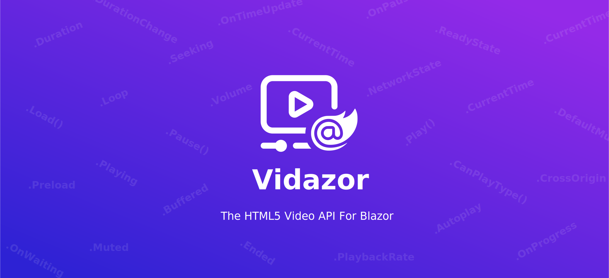

# What Is Vidazor? [](https://www.nuget.org/packages/Vidazor/)
Vidazor = Video + Blazor

Vidazor is a Blazor library (RCL) that allows you to seamlessly work with the HTML5 video API, which normally you'd have to work with manually via JS interop.

[Checkout the demo here](https://aradaral.github.io/Vidazor)

> Vidazor currently only supports Blazor WebAssembly, due to the fact that it uses `JSInProcessRuntime`, it won't work on Blazor Server projects at the moment.

# Getting Setup
You can set up Vidazor in your project in just 3 simple steps:
## 1. Install the NuGet package:
You can install the package via NuGet Package Manager, just search for "Vidazor".

Or if running commands is your thing, you can:
```powershell
Install-Package Vidazor
```
Or via the .NET CLI:
```bash
dotnet add package Vidazor
```
## 2. Add the imports:
After having installed the package, add the following `@using` directives either to the `_Imports.razor` file in your Blazor project, or if you intend to use Vidazor in a specific component, add the directives to the top of that component: 
```razor
@using Vidazor
@using Vidazor.Types
```
## 3. Start using the `<VidazorVideo>` component with a reference:
Now you're all set up! You can start using Vidazor!
In your components, use the `<VidazorVideo>` tag, and reference the component to a private field. Through the private field, you can access the properties and methods that Vidazor offers.
```razor
<VidazorVideo @ref="video" OnTimeUpdate="@(() => Console.WriteLine($"Current time is: {video.CurrentTime}"))">
    <source src="/sample.mp4" />
</VidazorVideo>

<button type="button" @onclick="() => video.Play()">Play</button>
<button type="button" @onclick="() => video.Pause()">Pause</button>
<button type="button" @onclick="() => video.Muted = !video.Muted">Toggle Sound</button>

@code {
    VidazorVideo video;
}
```
### Using HTML attributes on the `<video>` tag:
Vidazor supports [attribute splatting](https://docs.microsoft.com/en-us/aspnet/core/blazor/components/?view=aspnetcore-5.0#attribute-splatting-and-arbitrary-parameters), which means you can pass in any number of HTML attributes you want to the `<VidazorVideo>` component, and those attributes will then be captured and *splatted* onto the `<video>` element when the component is rendered.
```razor
<VidazorVideo @ref="video" class="foo bar" preload="auto">
    <source src="/sample.mp4" />
</VidazorVideo>
```
HTML ouput:
```HTML
<video class="foo bar" preload="auto">
    <source src="/sample.mp4" />
</video>
```

# Features:
Vidazor provides nearly all the methods, properties, and events that the JavaScript `HTMLMediaElement` object provides:
- [Methods](#methods)
- [Properties](#properties)
- [Events](#events)

## Methods:
The following methods can be called easily through the `Vidazor` object:
| Vidazor Method | JavaScript Equivalent | Description |
| :---            | :---                   | :---         |
| `.Play()` | [`.play()`](https://www.w3schools.com/tags/av_met_play.asp) | Plays the video playback. |
| `.Pause()` | [`.pause()`](https://www.w3schools.com/tags/av_met_pause.asp) | Pauses the video playback. |
| `.Load()` | [`.load()`](https://www.w3schools.com/tags/av_met_load.asp) | Reloads the video. |
| `.CanPlayType(string)` | [`.canPlayType(string)`](https://www.w3schools.com/tags/av_met_canplaytype.asp) | Checks if the browser can play a video with the specified MIME media type. |

## Properties:
The following properties can be accessed easily through the `Vidazor` object:
| Vidazor Property | Data Type | Get & Set | JavaScript Equivalent | Description |
| :--- | :--- | :--- | :--- | :--- |
| `.Autoplay` | `bool` | ✔ | [`.autoplay`](https://www.w3schools.com/tags/av_prop_autoplay.asp) | Gets or sets a Boolean indicating whether playback automatically begins as soon as enough of the video is available to do so without interruption. |
| `.Buffered` | `TimeRange[]` | Read-only | [`.buffered`](https://www.w3schools.com/tags/av_prop_buffered.asp) | Gets an array of `TimeRange` objects representing the parts of the video that the browser has buffered (i.e. loaded). |
| `.Controls` | `TimeRange[]` | ✔ | [`.controls`](https://www.w3schools.com/tags/av_prop_controls.asp) | Gets or sets a Boolean reflecting the "controls" HTML attribute, indicating whether browser's default UI controls are displayed for the video. |
| `.CrossOrigin` | `string` | ✔ | [`.crossorigin`](https://www.w3schools.com/tags/av_prop_crossorigin.asp) | Gets or sets the CORS settings of the video. |
| `.CurrentSrc` | `string` | Read-only | [`.currentSrc`](https://www.w3schools.com/tags/av_prop_currentsrc.asp) | Gets the source URL of the current video. Tip: To set the source URL, use the `Src` property. |
| `.CurrentTime` | `double` | ✔ | [`.currentTime`](https://www.w3schools.com/tags/av_prop_currenttime.asp) | Gets or sets a double indicating the current playback time in seconds. |
| `.DefaultMuted` | `bool` | ✔ | [`.defaultMuted`](https://www.w3schools.com/tags/av_prop_defaultmuted.asp) | Gets or sets a Boolean reflecting the "muted" HTML attribute, indicating whether the video is muted by default. |
| `.DefaultPlaybackRate` | `double` | ✔ | [`.defaultPlaybackRate`](https://www.w3schools.com/tags/av_prop_defaultplaybackrate.asp) | Gets or sets a double indicating the default playback rate (i.e. speed) for the video. |
| `.Duration` | `double` | Read-only | [`.duration`](https://www.w3schools.com/tags/av_prop_duration.asp) | Gets a double indicating the total length of the video in seconds. |
| `.Ended` | `bool` | Read-only | [`.ended`](https://www.w3schools.com/tags/av_prop_ended.asp) | Gets a Boolean indicating whether the video has ended. |
| `.Loop` | `bool` | ✔ | [`.loop`](https://www.w3schools.com/tags/av_prop_loop.asp) | Gets or sets a Boolean reflecting the "loop" HTML attribute, indicating whether the video should start over again after it has ended. |
| `.MediaGroup` | `string` | ✔ | [`.mediaGroup`](https://www.w3schools.com/tags/av_prop_mediagroup.asp) | Gets or sets the name of the media group that the video belongs to. |
| `.Muted` | `bool` | ✔ | [`.muted`](https://www.w3schools.com/tags/av_prop_muted.asp) | Gets or sets a Boolean indicating whether the video is muted or not. |
| `.NetworkState` | `NetworkdState` enum | Read-only | [`.networkState`](https://www.w3schools.com/tags/av_prop_networkstate.asp) | Gets a `NetworkState` enum indicating the current state of fetching the media over the network. |
| `.Paused` | `bool` | Read-only | [`.paused`](https://www.w3schools.com/tags/av_prop_paused.asp) | Gets a Boolean indicating whether the video is paused or not. |
| `.PlaybackRate` | `double` | ✔ | [`.playbackRate`](https://www.w3schools.com/tags/av_prop_playbackrate.asp) | Gets or sets a double indicating the current playback rate (i.e. speed) of the video. Can be a negative number, which indicates backward playback. |
| `.Played` | `TimeRange[]` | Read-only | [`.played`](https://www.w3schools.com/tags/av_prop_played.asp) | Gets an array of `TimeRange` objects representing the parts of the video that has been played by the user. |
| `.Preload` | `Preload` enum | ✔ | [`.preload`](https://www.w3schools.com/tags/av_prop_preload.asp) | Gets or sets a `Preload` enum reflecting the "preload" HTML attribute, indicating what content should be loaded before the video is played by the user. |
| `.ReadyState` | `ReadyState` enum | Read-only | [`.readyState`](https://www.w3schools.com/tags/av_prop_readystate.asp) | Gets a `ReadyState` enum indicating the readiness state of the video (e.g. whether enough of the video has been downloaded to be able to play the video, etc.) |
| `.Seekable` | `TimeRange[]` | Read-only | [`.seekable`](https://www.w3schools.com/tags/av_prop_seekable.asp) | Gets an array of `TimeRange` objects representing the parts of the video that the user can seek to (i.e. move the playback position to). |
| `.Seeking` | `bool` | Read-only | [`.seeking`](https://www.w3schools.com/tags/av_prop_seeking.asp) | Gets a Boolean indicating whether the user is currently seeking in the video. |
| `.Src` | `string` | ✔ | [`.src`](https://www.w3schools.com/tags/av_prop_src.asp) | Gets or sets a URL reflecting the "src" HTML attribute, indicating the source URL of the video. |
| `.Volume` | `double` | ✔ | [`.volume`](https://www.w3schools.com/tags/av_prop_volume.asp) | Gets or sets a double indicating the volume level, from 0.0 (silent) to 1.0 (loudest). |

## Events:
The following events can be hooked into through the `<VidazorVideo>` component. The type of all the events is the standard Blazor `EventCallback` struct:
| Vidazor Event | JavaScript Equivalent | Description |
| --- | --- | --- |
| `OnAbort` | [`abort`](https://www.w3schools.com/tags/av_event_abort.asp) | Fires when the loading of a video is aborted. |
| `OnCanPlay` | [`canplay`](https://www.w3schools.com/tags/av_event_canplay.asp) | Fires when the browser can start playing the video, but estimates that it will have to stop for further buffering (i.e. loading). |
| `OnCanPlayThrough` | [`canplaythrough`](https://www.w3schools.com/tags/av_event_canplaythrough.asp) |  Fires when the browser can play through the video without stopping for buffering (i.e. loading). |
| `OnDurationChange` | [`durationchange`](https://www.w3schools.com/tags/av_event_durationchange.asp) | Fires when the duration of the video is updated. |
| `OnEmptied` | [`emptied`](https://www.w3schools.com/tags/av_event_emptied.asp) | Fires when the current playlist is empty. |
| `OnEnded` | [`ended`](https://www.w3schools.com/tags/av_event_ended.asp) | Fires when the video has finished, and no further data is available. |
| `OnError` | [`error`](https://www.w3schools.com/tags/av_event_error.asp) | Fires when the video could not be loaded due to an error. |
| `OnLoadedData` | [`loadeddata`](https://www.w3schools.com/tags/av_event_loadeddata.asp) | Fires when the browser has loaded the current frame of the video. |
| `OnLoadedMetadata` | [`loadedmetadata`](https://www.w3schools.com/tags/av_event_loadedmetadata.asp) | Fires when the browser has loaded the video's metadata (e.g. length, etc.) |
| `OnLoadStart` | [`loadstart`](https://www.w3schools.com/tags/av_event_loadstart.asp) | Fires when the browser has started to load the video. |
| `OnPause` | [`pause`](https://www.w3schools.com/tags/av_event_pause.asp) | Fires when the video has been paused. |
| `OnPlay` | [`play`](https://www.w3schools.com/tags/av_event_play.asp) | Fires when the video has been started or is no longer paused. |
| `OnPlaying` | [`playing`](https://www.w3schools.com/tags/av_event_playing.asp) | Fires when the video has been started to play after having been paused OR stopped for buffering (i.e. loading). |
| `OnProgress` | [`progress`](https://www.w3schools.com/tags/av_event_progress.asp) | Fires preiodically when the browser loads the video. |
| `OnRateChanged` | [`ratechanged`](https://www.w3schools.com/tags/av_event_ratechanged.asp) | Fires when the playback rate (i.e. speed) of the video has changed. |
| `OnSeeked` | [`seeked`](https://www.w3schools.com/tags/av_event_seeked.asp) | Fires when the user has finished moving/skipping to a new position in the video. |
| `OnSeeking` | [`seeking`](https://www.w3schools.com/tags/av_event_seeking.asp) | Fires when the user begins moving/skipping to a new position in the video. |
| `OnStalled` | [`stalled`](https://www.w3schools.com/tags/av_event_stalled.asp) | Fires when the browser is trying to get media data, but data is unexpectedly not forthcoming. |
| `OnSuspend` | [`suspend`](https://www.w3schools.com/tags/av_event_suspend.asp) | Fires when the browser is intentionally not getting media data. |
| `OnTimeUpdate` | [`timeupdate`](https://www.w3schools.com/tags/av_event_timeupdate.asp) | Fires when the current time has changed. |
| `OnVolumeChange` | [`volumechange`](https://www.w3schools.com/tags/av_event_volumechange.asp) | Fires when the volume level has been changed. |
| `OnWaiting` | [`waiting`](https://www.w3schools.com/tags/av_event_waiting.asp) | Fires when the video stops because it needs to buffer (i.e. load) the next frame. |

# Copyright and License
This software is released under [the MIT license](https://github.com/AradAral/Vidazor/blob/main/LICENSE.md).
